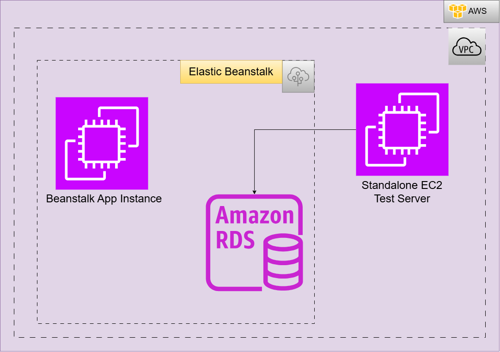

# README.MD

## Architecture diagram



## Step-by-step setup guide

### 1.  Elastic Beanstalk Environment Setup

- **Application Creation:** Created an application labeled as **`project1`**.
- **Environment Type:** Selected a dedicated **Web server environment**.
- **Platform Stack:** Configured the platform runtime as **Node.js**.
- **Application Code:** Chosen the automated **Sample application code** .
- **Configuration Preset:** Select **Custom configuration** to expose networking control blocks.
****

#### **2. IAM Identity Access Management Configuration**

- **Service Role Creation:** Created a service-linked execution role with an AWS Service entity type under the `elasticbeanstalk - env` use case wrapper. Attached it to the deployment wizard.
- **EC2 Instance Profile Generation:** Created an EC2 instance execution profile role. Verified the attachment of the three required platform policies:
    ◦ `AWSElasticBeanstalkMulticontainerDocker`
    ◦ `AWSElasticBeanstalkWebTier`
    ◦ `AWSElasticBeanstalkWorkerTier`
- **Create key pair and attach.**

#### **3. Networking & Database Integration Topology**

- **VPC Alignment:** Targeted the infrastructure container inside the default **VPC** boundary.
- **Compute Networking:** Marked the **Public IP address** generation choice as **Enabled**.
- **Database Activation:** Flipped the integrated **Enable database** configuration toggle to active.
- **Database Engine Specification:** Set the engine parameter to **MySQL** (Version: `8.4.8`).
- **Database Sizing Tier:** Select the instance class (`db.t4g.micro` ).
- **Database Credentials :** 
    ◦ Username*:* `admin`
  
    ◦ Password*:* `admin123`
  
• **Availability Mapping:**  **Low (one AZ)** to match free tier eligible.
• **Subnet :** Assigned database traffic mapping into **public** subnet zone.

#### 4. Configure the RDS Security Group.

- Open the **Amazon RDS Console** and click on your active database.
- Under the **Connectivity & security** tab, click the link under **VPC security groups** to open its settings.
- Select the security group, click the **Inbound rules** tab at the bottom, and click **Edit inbound rules**.

| TYPE | PROTOCOL | PORT RANGE | SOURCE |
| --- | --- | --- | --- |
| MySQL | TCP | 3306 | Beanstalk Environment SG ID |
| MySQL | TCP | 3306 | Select your `project1-server` sg ID |

#### 5.  EC2 Instance Setup

- Launch a separate EC2 instance named as `project1-server`  within same VPC of RDS.
- SSH into the EC2 instance using command.

```bash
ssh -i .\Downloads\singapore-pvt-key.pem ec2-user@<public-ip>
```

- Install a database client using following commands.

```bash
sudo yum update 
sudo yum install mariadb105 -y
#Connecting to RDS
sudo mysql -h <rds-endpoint> -u <username> -p
```

## Security considerations

- **No Public Exposure:** The Amazon RDS database instance has public accessibility turned off, ensuring it cannot be targeted or scanned from the public internet even though its in public subnet.
- **Security Group :** Inbound rules of security groups are keeping away unauthorized compute services because of source. Where I have given Security group ID of standalone EC2 and Elastic Beanstalk’s security group ID.

## Screenshots and output examples 

.png)

.png)

.png)
